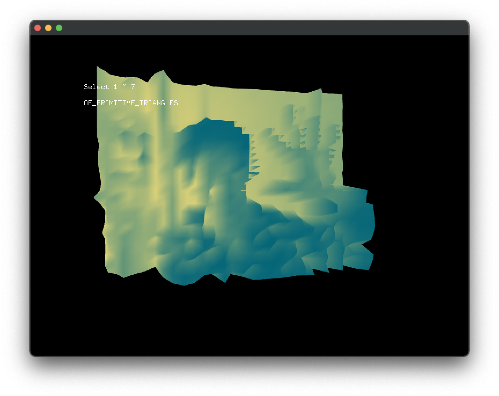

# cam_meshExample

### Learning Objectives

Studying the code behind this example will help you understand:

* How to access the webcam image using ``ofVideoGrabber``
* How to handle the mesh using ``ofmesh``
* How to iterate through a movie frame's pixels
* How to use ``getLightness()`` (returns the average of its RGB values) to display a different ASCII character

### Expected Behavior

When launching this app (if your computer has a webcam), you should see an mesh image of the webcam stream.

Instructions for use:

* Try presse key 1 ~ 7 to tour vertices connection modes.

### Classes used in this example

This example uses the following classes: 

* ``ofVideoGrabber``
* ``ofPixels``
* ``ofEasyCam``
* ``ofMesh``
